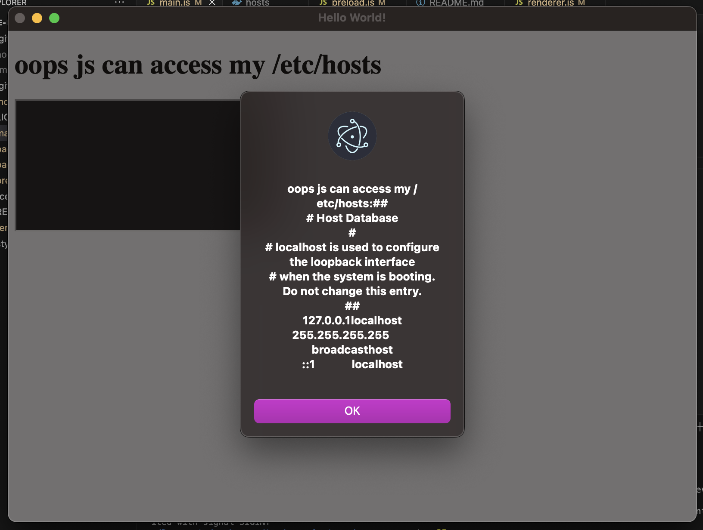

# rce-electron-example

A very minimal example of why a content security policy, `contextIsolation: true`, and `nodeIntegration: false` are required for renderer processes to avoid XSS and remote code execution (RCE) exploits.

- Write xss script to hypercore block
- Read that block and add it to the dom
- /etc/hosts or any other file can then be accessed
